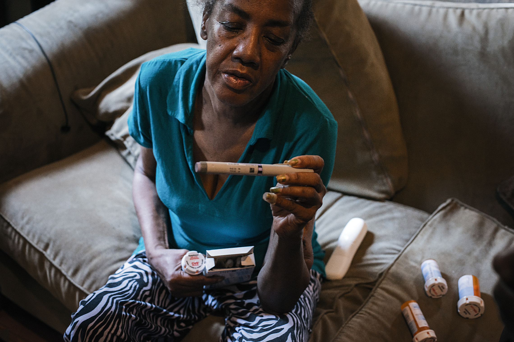

```{r setup, include = FALSE}
# Load necessary packages
library(tidyverse)
library(kableExtra) 
library(tidyverse)
library(tidytext)
library(textdata)
library(ggnetwork)
library(igraph)
library(shiny)
library(dplyr)
library(plotly)
library(shinythemes)
library(DT)
library(urbnmapr)
library(ggplot2)
library(RColorBrewer)
library(ggiraph)
library(naniar)
library(sf)
library(leaflet)
library(geojsonio)
library(maptools)
library(tmap)
library(pander)
library(mathjaxr)

# Set code chunk defaults 
knitr::opts_chunk$set(echo = FALSE, 
                      message = FALSE,
                      warning = FALSE,
                      fig.align = "center")

# Set R environment options
options(knitr.kable.NA = '')
```



# Introduction

In Louisiana, a row of toxic waste producing plants has gained national attention. In this area, large corporations continue to release larger and larger amounts of cancer-causing chemicals into the environment, and the effects on community health have been detrimental enough for this area to receive the name "Cancer Alley". The impacts of this unregulated pollution are not equally distributed: the groups at risk are predominantly black and low-income communities. Around the country, industries release fatal amounts of toxic chemicals into our environment, and underprivileged communities are most commonly the victims of these actions. The unequal distribution of wealth and power in our country, created by social systems that protect certain groups and leave others behind, has deep, historically established effects that extend even to the biological level. This is realized in the entangled relationship between sociodemographic inequality in the United States and toxicity in the environment. An individual's place within these imbricated factors is out of their control, and, yet, they can become major determinant's of an individual's health and wellbeing. 

## Questions

* Does geographic location of a county have an effect on the environmental and health statistics of a county?
* Does a classification as a Superfund Site make a county more likely to have detrimental environmental or health effects?
* What environmental considerations or sociodemographic inequalities exist throughout the US and within individual states? How do they present?
* What relationships, or lack thereof, exist between different sociodemographic variables? How strong are these relationships?
* What’s the distribution of different sociodemographic factors in the US? Is it normal? Is it skewed? If so, in what direction is it skewed?
* What conclusions and implications can we draw from the relationships between certain sociodemographic variables?
* Are sociodemographic determinants of mortality being acknowledged in the scientific research community?

# Data

In order to analyze environmental and sociodemographic factors related to mortality rates, we used data from the Environmental Protection Agency (EPA) and the Center for Disease Control (CDC). We downloaded the data on 9/28/21. We scraped data on Superfund sites, which are industrial sites considered a national priority in regards to their pollution level, from Wikipedia on 10/2/21. 

In order to analyze research pertaining to mortality causes, we scraped abstracts from a PubMed search on 10/29/21. Search inputs included "mortality" AND "cause" OR "determinant", and we limited results to only the United States. We unnested individual words from the abstracts, and then we retained only words of interest (e.g. we removed words like "the", "results", or "mortality" which would not provide interesting information, see word options in the network visualization for the full list of retained words).

# Results

<!-- could be interesting to start this section off with a simple but summative scatterplot (doesn't even have to be interactive) that shows overall relationship between mortality (response variable) and predictors of interest, including EQI, income, etc. (choose these based off of which factors are highlighted in our maps) -->

## Interactive map

The below code shows an example of how I used the `geojsonio` package to join our data on factors such as insecticides, income, etc. in order to utilize this data in `SpatialPolygons` for our `leaflet` choropleth map. This required transforming the data within the polygons into a dataframe and joining it with the data from our past csv files, and then transforming it back into polygons. In this example, I am simply adding on another variable "deaths" to the data portion of the Spatial Polygons and then merge that dataframe back into the polygons for use in the map. This was necessary to do for all of our variables I wanted to add into the polygons data.

```{r mapdata-code, echo = TRUE, eval = FALSE}
# show polygon data
library(geojsonio)
counties_all <- geojsonio::geojson_read("leaflet_map_1/counties_map.geojson", what = "sp")
counties_df <- as.data.frame(counties_all)
counties_df <- counties_df %>%
  mutate(deaths = (Total / (population / 100000)))

row.names(counties_df) <- sapply(slot(counties_all, "polygons"), 
                                 function(x) slot(x, "ID"))
counties_all <- SpatialPolygonsDataFrame(counties_all, counties_df)

names(counties_all)
```

Creating a choropleth map within leaflet and Shiny was fairly difficult, and in order to correctly create the colors for every variable in every county, I had to use colorQuantile for palettes and create `pal_colors` and `pal_labs` in order to accurately make a legend that did not just include the percentages. Different bins had to be made for the coal mining data since it did not have enough unique quantiles.

```{r color-code, echo = TRUE, eval = FALSE}
# code to understand color interactivity
counties_all@data$selected <- counties_all@data[, paste(type_choice_names[type_choice_values == input$typevar])]
    
if(input$typevar != "Proportion of Coal Mines") {
      palette <- colorQuantile("RdYlGn", domain = counties_all@data$selected, n = 10)
      counties_all@data$color <- palette(counties_all@data$selected)
      
      pal_colors <- unique(palette(sort(counties_all@data$selected)))
      pal_labs <- quantile(counties_all@data$selected, seq(0, 1, .1), na.rm = T)
      pal_labs <- paste(round(lag(pal_labs), digits = 3), round(pal_labs, digits = 3), sep = " - ")[-1] 
    }
    
    if(input$typevar == "Proportion of Coal Mines") {
      palette <- colorBin("YlOrRd", domain = counties_all@data$selected, 2)
      counties_all@data$color <- palette(counties_all@data$selected)
      pal_colors <- unique(palette(sort(counties_all@data$selected)))
      pal_labs <- c(-Inf, unique(quantile(counties_all@data$selected, na.rm = T)), Inf)
      pal_labs <- paste(round(lag(pal_labs), digits = 3), round(pal_labs, digits = 3), sep = " - ")[-1] 
    }
```

```{r map1-visualization, out.extra='style="border: none;"', fig.cap = "Leaflet Map Visualization with Superfund Sites"}
# embed shiny app once published
 knitr::include_app("https://caitlinlambert.shinyapps.io/leaflet_map_1/?_ga=2.43026016.474256613.1637255347-542459212.1632238530", height = "650px")
```

In the map above, one can locate their county, or any county of interest, and find how that geographical location corresponds to the variables of EQI, median income, mortality rates, insecticide usage, income inequality, percentage of coal mines, and healthcare-related businesses. Some common trends are that there is more income-inequality in urban areas. There are less healthcare-related businesses in rural areas, and more insecticide use in middle America. Coal mining centers around the Appalachian and Rocky Mountains. Superfund sites are actually scattered well across the country, but are more clustered around coastal areas.

### Interactive density plot
```{r data-gather, include = FALSE}
total_df <- read_csv("final_data.csv")

type_choice_names <- c("ln_hh_inc_x", "Total / (population / 100000)", "eqi_2jan2018_vc", "insecticide_ln_x", "gini_est_x", "std_coal_prim_pop_ln_y","hc_env_rate_ln_x")
type_choice_values <- c("Median Income", "Mortality Rate", "EQI", "Insecticide Applied","Income Inequality", "Proportion of Coal Mines", "Healthcare-related Businesses")
names(type_choice_names) <- type_choice_values

super_data <- total_df %>%
  filter(superfund == "TRUE")
not_data <- total_df %>%
  filter(is.na(superfund))
```

```{r density-super}
shinyApp(
  ######
  #ui
  ######
  
  ui <- fluidPage(
    
    titlePanel("Examining the Effects of Superfund Sites"),
    
    sidebarLayout(
      sidebarPanel(
        selectInput(inputId = "typevar",
                    label = "Choose a variable of interest to plot:",
                    choices = type_choice_values,
                    selected = "Median Income")),
      mainPanel(plotOutput(outputId = "plot")))),
  
  server <- function(input, output, session) {
    
    output$plot <- renderPlot({
      ggplot(total_df, aes(x = x)) + 
        geom_density(data = super_data, aes_string(x = type_choice_names[type_choice_values == input$typevar], 
                                                   y = "..density.."), fill="darkblue" ) +
        geom_density(data = not_data, aes_string(x = type_choice_names[type_choice_values == input$typevar], 
                                                 y = "-..density.."), fill = "lightblue") +
        xlab(input$typevar) +
        ylab("None Superfund vs. Superfund Sites")
    })
  },
  
  options = list(height = 500)
)
```

This density graph was created to examine the difference between county environmental and health data for counties that are classified as having Superfund Sites by the EPA and those that are not. For this, I made sure to put the use density rather than total count since there are more non-Superfund-Site counties than not, which would skew the results. Some things we can see in these graphs are that the mortality rate for Superfund-Sites are more tightly clustered around their maximum, while non-Superfund-Sites have closer to a normal distribution. However, Superfund Sites appear to have a higher median income and amount of healthcare-related businesses, which may be because Superfund Sites tend to be clustered in highly populated and industrialized areas like cities.

## Relationships by State

For the second visualization, we were interested in looking at a different choropleth map that shows indices of our variables of interests not only nationwide, but also statewide. For this visualization, we were interested in giving users the choice to explore these relationships closer at the state level, and a person can even zoom into the choropleth map above and view both visualizations side by side. In order to aid this, users are able to view a scatter plot and a density plot of their variable of interest for all the counties in their state of interest. This can help highlight inequalities within their state and users are further able to view their counties of interest on the scatter plots and examine them relative to others in the state. 

The click-hover-brush feature allows users to see values of a specific county in the scatter plot and a specific position on the plot of the density plot. Here is the code that I used to allow users to look closer at counties or points selected on the scatter plot. They can select counties of interest from the selectize input function. 

```{r hover code, echo = TRUE, eval = FALSE}
# Created Function for Hover/ Click Interactivity 
  output$scatter_info <- renderText({
    xy_str <- function(e) {
      if(is.null(e)) return("NULL\n")
      paste0("x=", round(e$x, 1), " y=", round(e$y, 1), "\n")
    }
    xy_range_str <- function(e) {
      if(is.null(e)) return("NULL\n")
      paste0("xmin=", round(e$xmin, 1), " xmax=", round(e$xmax, 1), 
             "ymin=", round(e$ymin, 1), " ymax=", round(e$ymax, 1))
    }
    
    paste0(
      "click: ", xy_str(input$plot_click),
      "dblclick: ", xy_str(input$plot_dblclick),
      "hover: ", xy_str(input$plot_hover),
      "brush: ", xy_range_str(input$plot_brush)
    )
  })
```

I used a similar function for the density plot and used the `plotly` package to enable hover interactivity for the map.

Here is the embedded shiny app. The entire US is currently selected, but users have the choice to view a specific state. Click on the map to view values of the index of choice for each county.

### Interactive Map and Associated Plots

```{r, out.width = "100%", out.height = "100%", out.extra = 'data-external="1" frameborder="no"'}
#Embed State Shiny Application
knitr::include_app("https://ql0crk-dasha-asienga.shinyapps.io/interactive_state_app/",
                   height = "1000px")
```

It’s visible that there is inequality and different environmental considerations throughout the United States. In looking at a map of the entire country or zooming in to a specific state, it’s visible that the value of the variables vary and there are areas that report higher or lower values for specific indices. For example, there are disproportionately more coal mines in mountainous areas and higher insecticide use in rural areas. Additionally, there is a visible rural-urban divide with regard to income level and income equality. 

Ultimately, it’s hard to quantify all the results that we can obtain from this visualization -- each state is different and there are many factors that may account for these differences. Essentially, the purpose of this visualization is to give a user the power to explore the data used to create this application and use that to inform their individual questions and draw their conclusions.

## Inter-Variable Relationships

Further than just looking at the distribution of variables of interest nationwide and statewide, we were further interested in looking at inter-variable relationships and allowing users to explore relationships of interest. To aid this, I created 2 additional Shiny apps: an interactive line graph and an interactive app that produces a simple linear regression output for any 2 variables of interest.

### Interactive Line Graphs

The interactive line graph allows users to view the relationship between 2 indexes of choice through a smooth curve. They also have the option to distinguish the data by color depending on whether counties are national priority sites. They can explore as many relationships as they choose. I used the `plotly` package to further allow users to hover over the line and view the value at a specific position on the plot. As opposed to the scatter plot in the shiny app above which has a fixed x-axis of median income, this app allows users all the flexibility. Here is the embedded Shiny app:

```{r, out.width = "100%", out.height = "100%", out.extra = 'data-external="1" frameborder="no"'}
#Embed Line Graph Shiny Application
knitr::include_app("https://ql0crk-dasha-asienga.shinyapps.io/line_graph/",
                   height = "500px")
```

Just like in the previous Shiny app, there are many insights that can be drawn from interacting with the app. We can look at one conclusion in-depth. At the moment, fungicide application and total deaths is selected and it’s interesting to see how the total number of deaths appears to increase as the amount of fungicides applied. The total number of deaths seem to increase much faster depending on the amount of fungicide applied for counties that are national priority sites. The entire line graph is also higher for these counties. This suggests that there may be many other factors at play at the sites, given that they are flagged as having higher toxicological levels, that may work together to exacerbate the effects of fungicide applied on total deaths and make populations in these counties more vulnerable. 

### Interactive Simple Linear Regression 

Lastly, to further allow users to explore bivariate relationships in much further depth, I created a Shiny application that runs a linear regression model on any 2 variables of interest. The application reactively takes in any 2 variables of interest, fits a simple linear regression model, produces the summary output and a linear model plot, pulls out important statistical values such as the adjusted r-squared and the p-value, and then interprets the results on behalf of the user. The reactive linear model function that I used is as follows:

```{r lm-function, echo = TRUE, eval = FALSE}
# Create reactive linear model formula
  lm1 <- reactive({
    lm(reformulate(input$predictor, input$response), data = county_data)
    })
```

In order to achieve this, I used the `MathJax` package in R in multiple ways. Here is an example of how I used the package to pull out important statistical results:

```{r mathjax, echo = TRUE, eval = FALSE}
 # Pull out and print results from SLR output
  output$results <- renderUI({
    withMathJax(
      paste0(
        "Adj. \\( R^2 = \\) ", round(summary(lm1())$adj.r.squared, 3),
        ", \\( \\beta_0 = \\) ", round(lm1()$coef[[1]], 3),
        ", \\( \\beta_1 = \\) ", round(lm1()$coef[[2]], 3),
        ", P-value ", "\\( = \\) ", signif(summary(lm1())$coef[2, 4], 3)
      )
    )
  })
```

Users are warned to check diagnostic conditions for linear models before drawing final conclusions. Because the primary purpose of the app is not to run statistical analyses on all the variables, that output is not provided for users. Ultimately, the purpose of the app is to fit simple linear models and allow users to see which variables are strongly correlated and explore what that might mean:

```{r, out.width = "100%", out.height = "100%", out.extra = 'data-external="1" frameborder="no"'}
#Embed SLR Shiny Application
knitr::include_app("https://ql0crk-dasha-asienga.shinyapps.io/SLR_app/",
                   height = "1200px")
```

Just like in the previous Shiny app, there are many insights that can be drawn from interacting with the app and the purpose of creating the interactivity is to allow users to make those conclusions and grapple with the implications themselves. However, we can look at the same relationship we examined on the linear graphs: fungicide application as a predictor for total deaths. From the output, we can see that the adjusted R-squared is quite low at 0.019, suggesting that the variance in total deaths explained by fungicides applied is very low. This makes sense as there are many factors interacting to explain death rate. However, what’s more striking is the strong correlation between the 2 variables, and a t-test for slope yields a p-value of 0. In looking back at the interactive map, we see that fungicide application is not evenly distributed throughout the US and is more in the west coast, parts of the mid-west, and Florida. Even within states, there are certain counties that have higher fungicide application, and one can look at the first map to determine whether those areas are national priority sites or not. This highlights the inequality and/ or different environmental considerations that exist when it comes to fungicide use in different geographic locations in the US. In knowing the strong relationship between fungicide application and total deaths, this has huge implications and leads to further questions such as what predisposes certain areas to higher fungicide application versus others?

Ultimately, this is just one question resulting from one bivariate analysis, but there are many such questions and considerations that a user can explore using this application.

## Mortality rate vs. Income

```{r death-income, fig.width = 6, fig.height = 4}
slr_data <- read_csv("final_data.csv") %>% 
  select(med_income = ln_hh_inc_x, 
         mortality_rate = rate) %>% 
  mutate(mortality_rate = mortality_rate * 1000)

theme_set(theme_classic())

ggplot(slr_data, aes(x = med_income, y = (mortality_rate))) +
  geom_point(color = "darkgray", alpha = .6, shape = 20) +
  geom_smooth(method = "lm", se = FALSE, color = "#0047AB") +
  xlab("Median Income (ten thousand dollars)") +
  ylab("Mortality Rate (deaths per 1,000 people)") +
  labs(title = "Relationship between median income and mortality", 
       subtitle = "U.S. counties, 2006-2010", 
       caption = "Data from EPA and CDC")

sjPlot::tab_model(lm(mortality_rate ~ med_income, data = slr_data))
```

There is a statistically significant negative linear relationship between mortality rate and median income in counties in the US from 2006-2010. 

## Word counts in research abstracts {.tabset .tabset-fade .tabset-pills}

### Animated bar chart


In the above animation, the top 10 words up until 2011 do not contain the word "social". In 2011, though, "social" enters the top ten words, and its ranking increases until 2021, when it is the most used word in research abstracts.

### Code

The below code demonstrates how we used the `gganimate`, which builds off of the `ggplot2` package, and `gifski` packages to create an animated bar chart of top words used in abstracts over time. We used the `gganimate` package to create an animated object from `barchart`, which was a static barchart of top words that we created using `ggplot2`. We used the `gifski` package to render a gif from out animation. 

```{r barchart-code, echo = TRUE, eval = FALSE}
#create animated object from ggplot barchart
anim <- barchart +
  #transition by publication_year
  transition_states(publication_year, 
                    transition_length = 8, state_length = 4, wrap = FALSE) +
  view_follow(fixed_x = TRUE) + #x scale should be animated and modified by the view
  ease_aes('sine-in-out') + #smooth out animations
  
#create gif
animate(anim, #object to create gif
        500, #sets length in seconds
        fps = 20, #defines frames per second
        width = 900, height = 750, #sets dimensions
        renderer = gifski_renderer("data/gganim2.gif"), #renders and saves gif
        end_pause = 15, start_pause =  15 #length of pauses between repeats) 
```

## Word networks in research abstracts {.tabset .tabset-fade .tabset-pills}

### Interactive network

```{r network-wrangling, include = FALSE, eval = TRUE}
#read in list of abstracts
abstract_words <- read_csv("data/abstract_words.csv") 

#set seed and theme
set.seed(83426)
theme_set(theme_classic())

######
#data wrangling
######


empty <- data.frame(word = character())
keep_words <- empty %>%
  add_row(word = c("mortality", "disease", "age", "cancer", "women", "population", "hiv", "social",
                   "clinical", "children", "infection", "protein", "genetic", "blood",
                   "cardiovascular", "community", "diabetes", "heart", "exposure",
                   "gene", "national", "drug", "chronic", "physical", "virus",
                   "hospital", "sex", "smoking", "therapy", "interventions", "white",
                   "genes", "family", "race", "weight", "education", "alcohol",
                   "breast", "maternal", "antibodies", "lung", "income", "disparities",
                   "environmental", "obesity", "tumor", "region", "african", "stroke",
                   "cardiac", "viral", "hypertension", "immune", "respiratory", "hispanic",
                   "food", "infections", "dna", "infant", "gender", "socioeconomic",
                   "history", "coronary", "racial", "demographic", "mental", "male",
                   "underlying", "child", "infants", "poor", "ethnic", "rural",
                   "antibody", "pulmonary", "renal", "policy", "efforts", "female",
                   "sexual", "depression", "behavioral", "influenza", "economic", "genome",
                   "urban", "ethnicity"))

interest_words <- empty %>%
  add_row(word = c("mortality", "social", "disparities", "cancer", "community",
                   "genetic", "environmental", "family",
                   "racial", "demographic", "economic", "exposure")) %>% 
  mutate(category = NA)
interest_words$category[interest_words$word %in% c("mortality", "cancer")] <- "mortality"
interest_words$category[interest_words$word %in% c("social", "disparities", "racial", "demographic", 
                                    "economic")] <- "sociodemographic"
interest_words$category[interest_words$word %in% c("community", "family")] <- "contextual"
interest_words$category[interest_words$word %in% c("genetic")] <- "genetic"
interest_words$category[interest_words$word %in% c("environmental", "exposure")] <- "exposure"
```

```{r network-display, out.extra='style="border: none;"', out.width='56%'}
shinyApp(
######
#ui
######

ui <- fluidPage(
  
  # tabPanel(
    titlePanel("Network of words used in research abstracts exploring mortality causes"),

    sidebarLayout(
      sidebarPanel(
        sliderInput("year_b", "Year:",
                   min = 1985, max = 2021, sep= "",
                   value = 2006), 
        selectizeInput(inputId = "interest_list", 
                       label = "Select words to include:", 
                       choices = keep_words$word, 
                       selected = interest_words$word,
                       multiple = TRUE
        )
      ),
      mainPanel(
        fluidRow(width = 12, 
                 plotOutput(outputId = "network")), 
        fluidRow(width = 5, 
                 tableOutput(outputId = "plot_info"))
        
      )
    # )
  )
), 

######
#server
######

server <- function(input, output) {

  #words of interest not found in year
  interest_missing <- reactive({
    present <- abstract_words %>% 
      filter(publication_year == input$year_b) 
    missing <- setdiff(as.list(input$interest_list), as.list(present$word))
    if(length(missing) > 0) {data <- paste(missing, collapse = ", ")}
    else {data <- "NA"}
  })
  
  abst_igraph <- reactive({
    #choose interest words from year
    network_words <- abstract_words %>% 
      filter(publication_year == input$year_b) %>% 
      filter(word %in% input$interest_list) %>% 
      count(word, sort = TRUE) %>%  #get counts of words  
      left_join(interest_words, by = "word")
    #create dataframe
    df <- abstract_words %>%
      filter(publication_year == input$year_b) %>% #keeps only year of interest
      right_join(network_words, by = "word") %>% #only keeps interest words
      unique() %>% #remove repeats of connections in same abstract
      select(pmid, word) %>%
      table() %>%
      crossprod() #creates co-occurence matrix
    diag(df) <- 0 #sets connections between same word to 0
    df <- as.data.frame(df) #forces table to dataframe
    num_word <- ncol(df) #number of words = numbers of column
    
    #define vertices and edges
    ve <- network_words #interest words from years, including counts
    ed <- df %>%
      mutate(from = rownames(.)) %>% #create "from" w/ row names for gather function 
      #gathers co-occurences from matrix, column names to "to" column, number of co-occurences to "weight"
      tidyr::gather(to, weight, 1:num_word) %>% 
      mutate(weight = ifelse(weight == 0, NA, weight)) #weights of 0 to NA
    
    #create igraph
    graph_from_data_frame(d = ed,
                                         vertices = ve,
                                         directed = FALSE) %>%
      simplify() #remove duplicate edges
  })
  
  #network
  output$network <- renderPlot({
    set.seed(83426)
    
    #plot network
    abst_network <- ggnetwork(abst_igraph())
    ggplot(data = abst_network, aes(x = x, y = y,
                                   xend = xend, yend = yend)) +
      geom_edges(aes(size = weight), 
                    color = "lightgray", curvature = .1) +
      geom_nodes(aes(size = n, color = category), shape = 20)  +
      geom_nodetext_repel(aes(label = name, size = n), repel = TRUE, 
                    point.padding = unit(0.2, "lines"), color = "gray10") +
      ggraph::scale_edge_width(c(0.5, 5)) +
      # geom_nodes() +
      # geom_nodelabel(aes(label = name, size = n), nudge_x = .01) +
      theme_blank() +
      labs(size = "Number", color = "Category", 
           caption = paste("Words not found: ", interest_missing(), 
                           "\n Data source: PubMed")) 

  })
  
  output$plot_info <- renderText({
    abst_stat <- data.frame(name = vertex_attr(abst_igraph(), "name"),
                            strength = strength(abst_igraph(), 
                                                weights = edge_attr(abst_igraph(), "Weight"))) 
    abst_stat %>% 
      arrange(desc(strength)) %>% 
      head(5) %>% 
      knitr::kable("html", row.names = FALSE, col.names = c("Word", "Strength")) 
      
  })
}, 

options = list(height = 650)
)

```

In the above network, we use strength, a weighted measure of the degree of each word, to measure centrality. Initially, sociodemographic words tend to not be central to the network. Over time, though, sociodemographic factors rise in centrality. In 2017, "social" supersedes even the word "mortality" in its centrality. By 2021, we see the words "disparities" and "racial" enter the top 5 central words in abstracts. 

### Code

To create a list of connections between words and how often those connections occured, we created a co-occurence matrix of words individual abstract. The below code demonstrates how we prepared our data from `abstract_words`, which was a dataframe which contained a column with the unique identifier for each abstract, the year that abstract was published in, and a word of interest from that abstract.  

```{r network-code, echo = TRUE, eval = FALSE}
#create dataframe with co-occurence matrix
df <- abstract_words %>%
  #keeps only year of interest based off of input from user in Shiny
  filter(publication_year == input$year_b) %>% 
  right_join(network_words, by = "word") %>% #only keeps interest words
  unique() %>% #remove repeats of connections in same abstract
  select(pmid, word) %>%
  table() %>% 
  crossprod() #creates co-occurence matrix of connections 
diag(df) <- 0 #sets connections between same word to 0
df <- as.data.frame(df)

#define edges from co-occurence matrix
ed <- df %>%
  mutate(from = rownames(.)) %>% #create "from" column from row names 
  #gathers co-occurences from matrix,
    #create "to" column from column names, 
    #create "weight" column from number of co-occurences
  tidyr::gather(to, weight, 1:ncol(df)) %>% 
  mutate(weight = ifelse(weight == 0, NA, weight)) #weights of 0 to NA
```

# Conclusion

The map displaying county data shows that there are some geographic factors that influence the statistics of the counties' environmental and health. There are clear regional differences attributed to proportion of coal mining and amount of insecticide applied. In addition, we can spot a urban-rural divide in terms of higher income inequality in counties that have major cities and less healthcare-related businesses in rural areas. Surprisingly, there are actually only very subtle differences between counties that are classified as Superfund Sites versus those that are not. Part of this may be because superfund sites are clustered on the coasts and in heavily-populated areas, which overall have a higher income and more healthcare options.

From the second interactive map and associated plots, tt’s evident that many socio demographic factors interact with each other to explain some of the geographic inequalities and environmental considerations throughout the US. In looking at the map of the entire US, it is evident that the different socio demographic indices vary between states, and in looking closer at the individual states, it is clear that these indices vary even within states between counties. Looking at specific states also highlights how some indices have a normal distribution in some while a skewed distribution in others. After examining these statewide and nationwide differences, one might wonder what this all means. Looking at the bivariate relationships highlights the importance and huge implications for this, for example, in looking at how fungicide application has strong linear relationship with total deaths and a t-test for slope in a simple linear regression model yields a p-value of 0. The map shows that fungicide use is not evenly spread throughout the nation, and it’s important to grapple with what factors contribute to this distribution. 

Thus, we have substantially confirmed the relationship between sociodemographic and environmental factors and mortality. Our analysis of research abstracts demonstrates the increasing acknowledgement of this relationship. The recent significant increase in the word "social" in research abstracts suggests that sociodemographic determinants are being increasingly acknowledged in the scientific research community. The recent increase in connectedness of sociodemographic words in abstracts also suggests these determinants are increasingly included in the majority of the body of mortality research. In particular, the rise of the words "racial" and "disparities" demonstrate acknowledgement of the structural inequalities inherent to these issues. These findings are promising; slowly, the rampant inequality in health outcomes around the United States is becoming acknowledged in research communication. 

## Limitations and Future Directions

A limitation of this project is that we did not have data nor analyses to look closer at what the demographic makeup of specific locations is, but further analyses can extend on our work in understanding what further factors there might be to consider. We were also limited in that our data were from the time frame of 2006-2010. Future directions may include expanding the time frame and finding data for individual years, so that we may track how our relationships change over time. Understanding whether effects are increasing or decreasing can inform how we understand the efficacy of current interventions. 

Our findings on the focus of research over time is promising. The rise in the consideration of social factors and their connection to mortality shows increased acknowledgement of the inequality of mortality risks. However, the gap between research and policy is often wide and difficult to bridge. Progressive findings in scientific abstracts, while representative of the inclusion of social thought into clinical work, are not an accurate measure of whether tangible change is being generated from these conclusions. Through lobbying, corporations have a much larger influence in restricting the passage of policies that may reduce their profits than in research (though the influence on scientific research is still present, through funding sources). To assess whether policy makers are putting forth legislation that addresses the root socio demographic causes of unequal mortality risk, and whether that inequality is even acknowledged in the first place, we would like to  extend our project in the future by analyzing legislation that is proposed/passed in regards to environmental toxicity and mortality. This can allow us to understand whether there is a lag between research and legislation and to explore how the government is addressing health inequalities. 

# References

